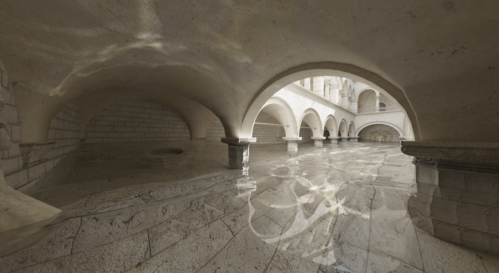

# A little toy path tracer

My submission for assignment 4 of the Rendering lecture @ TU Wien.




The `ray_gen_shader.rgen` has some fun options to play around with:

```glsl
#define RR true // russian roulette
#define NNE true // next event estimation
#define BDPT false // bidirectional path tracing (first diffuse bounce only)
#define SMS true // specular manifold sampling
```


Sources:\
Specular Manifold Sampling for Rendering High-Frequency Caustics and Glints
(Zeltner et al., [2020](https://dl.acm.org/doi/pdf/10.1145/3386569.3392408)).
